# Howdy CLI

Howdy CLI is a declarative terminal UI library for Dart. It provides a robust set of interactive widgets, terminal I/O management, and a flexible theming API to build beautiful command-line workflows.


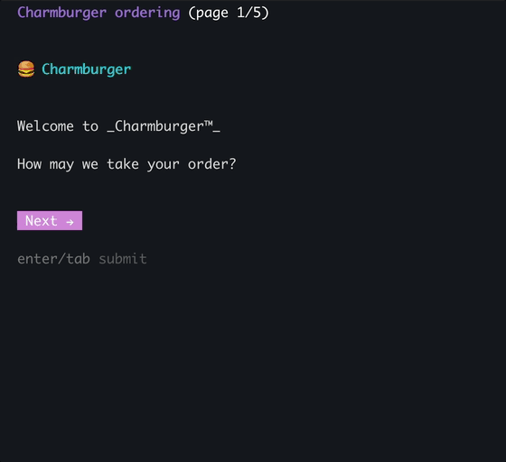

> **NOTE**
>
> I was heavily inspired by and heavily ripped off [Huh?](https://github.com/charmbracelet/huh). If you're language agnostic, that library is battle tested and likely more stable.

```dart
final results = Form.send(title: 'Charmburger ordering', [
  Note([
    Text(
      '\n🍔 Charmburger\n',
      style: TextStyle(
        bold: true,
        foreground: Color.cyan,
      ),
    ),
    Text('Welcome to _Charmburger™_\nHow may we take your order?\n'),
  ], next: true),
  Page([
    Select<String>(
      'Choose your burger',
      help: 'At Charm we truly have a burger for everyone.',
      options: [
        Option(label: 'Charmburger Classic', value: 'Charmburger Classic'),
        Option(label: 'Chickwich', value: 'Chickwich'),
        Option(label: 'Fishburger', value: 'Fishburger'),
        Option(
          label: 'Charmpossible™ Burger',
          value: 'Charmpossible™ Burger',
        ),
      ],
      validator: (v) => v == 'Chickwich' 
                          ? 'no chicken today, sorry' 
                          : null,
      key: 'burger',
    ),
    Multiselect<String>(
      'Toppings',
      help: 'Choose up to 4.',
      options: [
        Option(label: 'Lettuce', value: 'Lettuce'),
        Option(label: 'Tomatoes', value: 'Tomatoes'),
        Option(label: 'Charm Sauce', value: 'Charm Sauce'),
        Option(label: 'Jalapeños', value: 'Jalapeños'),
        Option(label: 'Cheese', value: 'Cheese'),
        Option(label: 'Vegan Cheese', value: 'Vegan Cheese'),
        Option(label: 'Nutella', value: 'Nutella'),
      ],
      defaultValue: ['Lettuce', 'Tomatoes'],
      validator: (v) {
        if (v.isEmpty) return 'at least one topping is required';
        if (v.length > 4) return 'Maximum 4 toppings allowed';
        return null;
      },
      key: 'toppings',
    ),
  ]),
  // ...
]);
```

- **Extendible:** Use built in widgets or write your own.
- **Declarative Components:** Easily build forms and interactive prompts.
- **Theming System:** Centralized styling for colors, borders, icons, and text.
- **Low-Level Terminal Control:** Exposed primitive terminal functions for cursors, escape sequences, and screen buffers.

---

## Included Widgets

Howdy CLI comes with a rich set of built-in widgets for both collecting input and displaying output.

### Interactive Widgets

Widgets that expect input back from the user.

#### `Prompt`

A single-line text input field with support for an optional placeholder and inline validation.

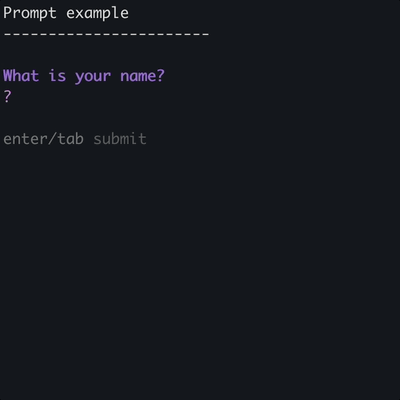

---

#### `Textarea`

A multi-line text input field that renders with a pipe-bordered region and supports word wrapping.

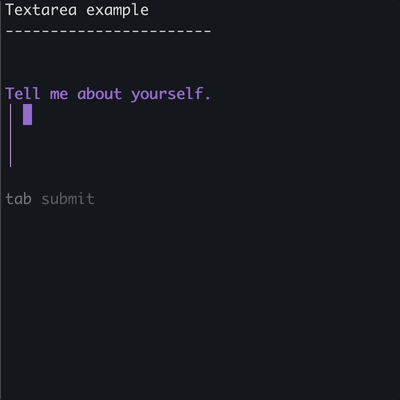

---

#### `Select`

A single-choice list of options rendered as a scrollable menu with a highlighted cursor.

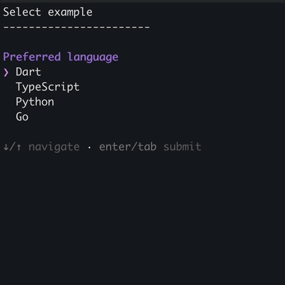

---

#### `MultiSelect`

A multiple-choice list of options where users can toggle individual items before submitting.

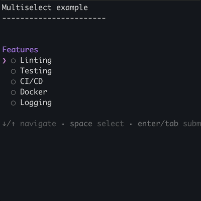

---

#### `ConfirmInput`

A boolean yes/no confirmation prompt rendered as a single-line toggle.

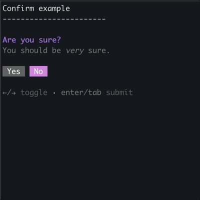

---

#### `FilePicker`

An interactive directory browser that lets users navigate the filesystem and select a file.

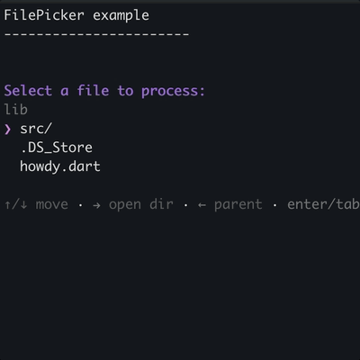

---

### Display Widgets

Widgets that don't expect input back from the user.

#### `Text`

A simple widget for rendering a single block of styled terminal text.

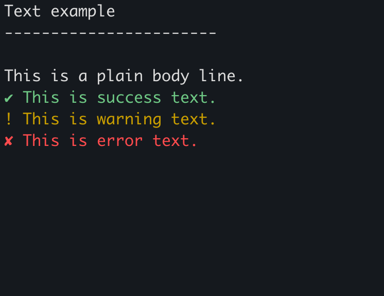

---

#### `Sign`

A bounded, styled box with configurable padding and automatic text wrapping for displaying information panels.

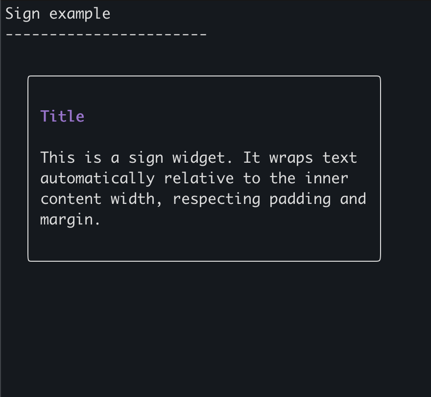

---

#### `Table`

A widget for rendering tabular data with customizable borders, column widths, and cell alignment.

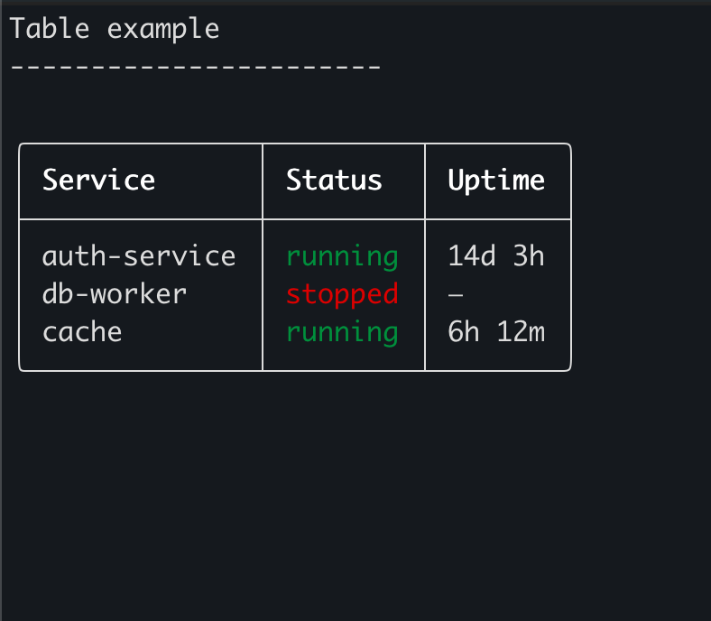

---

#### `Spinner` and `SpinnerTask`

A spinner is an animated progress indicator for displaying indeterminate loading states inline.

A SpinnerTask is a convenience wrapper around `Spinner` that ties an async task to the spinner lifecycle, completing automatically when the task resolves.

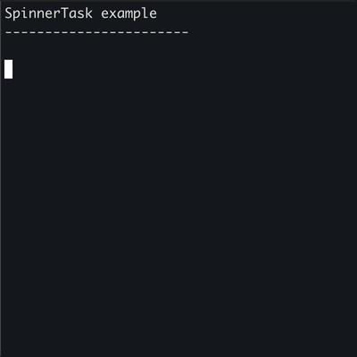

---

#### `FileTree`

A read-only display widget that renders a directory tree structure with icons and indentation.

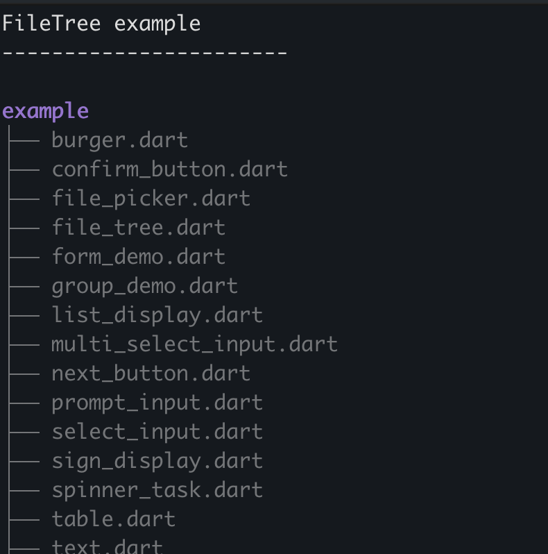

---

#### `BulletList` and `NumberList`

A scrollable, keyboard-navigable list for displaying collections of items as output.


---

### Forms and composition

#### `Form`

Forms are used to create multi-widget workflows that orchestrates multiple `Page` widgets, managing state, validation, and navigation between pages.

#### `Note`

A lightweight inline annotation widget for displaying contextual hints or messages within a `Form`.

#### `Page`

A container that groups a set of widgets into a single form page, managing focus traversal across its children.

#### `NextButton`

A tappable button widget used to advance to the next step in a `Form` or multi-page flow.

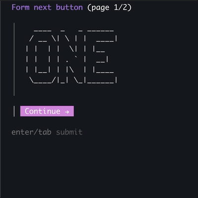

---

## 3. Write Your Own Widgets

You can easily build custom widgets by extending one of the three base classes provided by the framework.

- **`InputWidget<T>`**: Extend this for interactive input widgets. You must override:
  - `T get value`: Returns the widget's current value.
  - `KeyResult handleKey(KeyEvent event)`: Processes individual keystrokes. Return `KeyResult.consumed` if the key changed state (triggers a re-render), `KeyResult.ignored` if it wasn't relevant, or `KeyResult.done` when the widget is finished collecting input.
  - `String build(IndentedStringBuffer buf)`: Renders the visual state into `buf` and returns it as a string.
- **`DisplayWidget`**: Extend this for output-only widgets that display content without capturing input. Only `build` needs to be overridden.
- **`Widget<T>`**: The sealed base class both of the above extend. Implement this directly only if you need fully custom lifecycle behaviour.

```dart
class MyWidget extends InputWidget<String> {
  MyWidget('My Widget title');

  String _input = '';

  @override
  String get value => _input;

  @override
  KeyResult handleKey(KeyEvent event) {
    if (event case CharacterKey(:final char)) {
      _input += char;
      return KeyResult.consumed;
    }
    if (event == SpecialKey(Key.enter)) {
      return KeyResult.done;
    }
    return KeyResult.ignored;
  }

  @override
  String build(IndentedStringBuffer buf) {
    buf.writeln('Enter something: $_input');
    return buf.toString();
  }
}
```

---

## 4. Themes

Howdy CLI features a centralized hierarchical theming API. This ensures consistent styling across all widgets, managing focus and blur states automatically.


### Use themes

To use one of the included themes, set the static `current` field.

```dart

Theme.current = Theme.dracula();

```

### Included Themes

Out of the box, the following themes are provided:
- `Theme.charm()`: The default, vibrant theme.
- `Theme.standard()`: A minimal theme using standard base terminal colors.
- `Theme.dracula()`: Based on the popular Dracula color scheme.
- `Theme.base16()`: A 16-color ANSI palette theme.
- `Theme.catppuccin()`: Based on the Catppuccin Mocha color scheme.

### Using Theme API to write your own

You can create a custom theme by instantiating the `Theme` class and providing specific `FieldStyles`, `GroupStyles`, and `FormStyles`.

```dart
final myTheme = Theme(
  focused: FieldStyles(
    text: TextStyles(
      prompt: TextStyle(foreground: Color.blue, bold: true),
    ),
    // ...other styles
  ),
  blurred: FieldStyles(/*...*/),
);
```

### 4.1 Colors, border styles, padding, text styles, icons

Themes are composed using structural styling primitives:
- **Colors**: ANSI and RGB colors via the `Color` class (e.g., `Color.redLight`, `Color.magenta`).
- **Text Styles**: Apply foreground/background colors, boldness, dimming, and italics to text using `TextStyle`. Can be quickly applied using the `.style(...)` string extension.
- **Border Styles**: Configure characters used for widget bounding boxes with `BorderType` (e.g., standard, rounded).
- **Padding/Margin**: Control spatial rules with `EdgeInsets` (e.g., `EdgeInsets.all(1)`).
- **Icons**: Easily retrieve cross-platform terminal icons (like `Icon.dot`, `Icon.pointer`, `Icon.check`) via the `Icon` class.

---

## 5. Terminal Functionality Exposed

The framework exposes raw terminal manipulation via the `Terminal` singleton and helper methods for advanced command-line UI creation.

- **Raw Mode (`enableRawMode`, `runRawMode`)**: Bypasses terminal line buffering to read individual keystrokes (useful for custom interactive widgets).
- **Key Event Parsing (`readKeySync`)**: Automatically translates complex ANSI escape sequences into `KeyEvent` objects like `SpecialKey(Key.arrowUp)`.
- **Screen Buffer Management (`updateScreen`, `clearScreen`)**: Effortlessly redraws the screen without flickering, automatically counting physical lines for efficient screen erasure.
- **Cursor Control**: Directly control the cursor shape (`CursorShape.blinkingBar`, `CursorShape.steadyBlock`) and position (`cursorUp`, `cursorDown`, `cursorHide`, `cursorShow`).
- **Erasing**: Exposed constants and methods for clearing the screen (`eraseLine`, `eraseScreenDown`, etc.).
- **Signal Handling**: Robust teardown logic ensures that when the script receives a `SIGINT` (Ctrl+C), raw mode is disabled and the cursor is cleanly restored.
